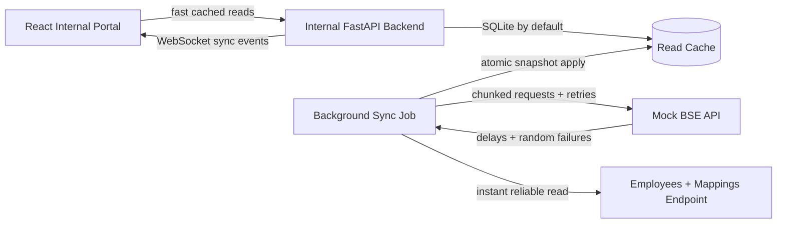

# Architecture

The portal never calls BSE directly. Every screen reads from the backend cache, so clients, trades, employees, my clients, and incentives can load in under one second with whatever data has already been synced. If BSE is slow, failing, or offline, the backend keeps serving the last consistent cache.

The mock BSE API exposes paginated clients and trades. Each page can delay and randomly fail, which makes a full pull fail midway when a later page errors. The backend fetches all pages first, retries failed pages with backoff, and only writes to the database after the complete snapshot has been fetched. That keeps partial pulls from leaking into management screens.

The sync job is guarded by a process lock and APScheduler `max_instances=1`, so overlapping refreshes do not run concurrently. Database writes use primary-key upserts for clients, trades, and employees, and mappings are replaced inside the same transaction. Incentives are recomputed after the snapshot is applied using the current employee-client mapping and trade brokerage totals.

Open browser screens subscribe to `/ws/live`. After a successful sync commit, the backend broadcasts `sync_complete`; the React app invalidates its cached queries and refetches the visible data without a page refresh. If WebSocket reconnects are in progress, the status endpoint is also polled every five seconds as a fallback.

## Running At 100x Data Volume

For 50,000 clients and 500,000 trades, keep the same shape but swap the local defaults for production primitives:

- Use PostgreSQL instead of SQLite, with indexes on `trades(client_id)`, `trades(trade_date)`, `mappings(employee_id)`, and `clients(pan)`.
- Load BSE pages into staging tables with `sync_id`, then promote with set-based `INSERT ... ON CONFLICT DO UPDATE` inside one transaction.
- Partition trades by `trade_date` once history becomes large.
- Store incentive summaries in a materialized table keyed by `employee_id` and refresh only affected employees after incremental syncs.
- Move the scheduler to a worker queue such as Celery/RQ and publish live events through Redis pub/sub when multiple backend instances are running.
- Replace offset pagination with cursor/watermark pulls if the upstream API supports it, so retries resume from a stable checkpoint.
